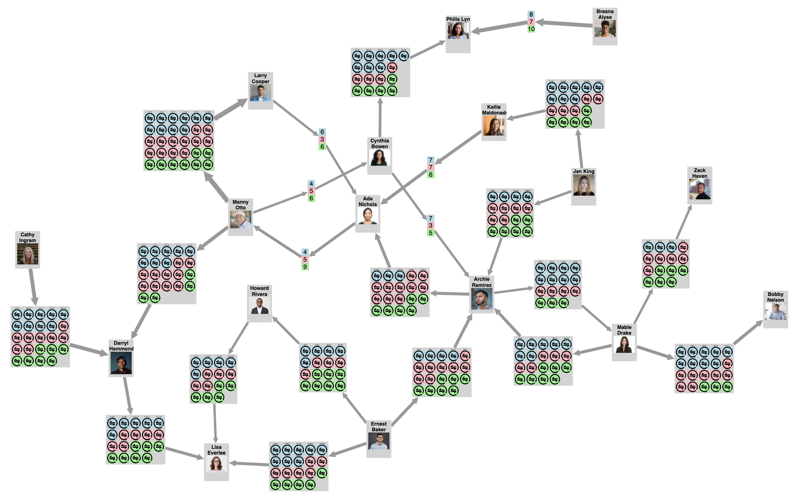

# cytoscape-transaction-layout

## Description

This is a specialized layout for graphs with large numbers of transactions between people. The layout aggregates transactions into sorted clusters and positions nodes using a forced directed layout. Functionality is provided to toggle clusters between a simplified and detailed view.

<p align="center"></p>

## Dependencies

-   cytoscape: ^3.19.0
-   cytoscape-fcose: ^2.1.0

## Usage instructions

Download the library:

-   via npm: `npm install cytoscape-transaction-layout`
-   via direct download in the repository

ES import:

```js
import cytoscape from 'cytoscape';
import { register as transactionLayout } from 'cytoscape-transaction-layout';
cytoscape.use(transactionLayout);
```

CommonJS:

```js
let cytoscape = require('cytoscape');
let layout = require('transactionLayout');

cytoscape.use(layout);
```

## API

```js
// Default layout options listed
let options = {
    name: 'transaction',

    // Called when compound node is collapsed or expanded respectively
    // Useful for applying style changes to compound nodes
    onCollapseCompoundNode: (compoundNode) => {},
    onExpandCompoundNode: (compoundNode) => {},

    // Function to determine the edge width based on the number transactions for an edge
    edgeWidthFunc: (transactionCount) => {
        return transactionCount;
    },

    // Compare to function to determine the order of transactions within a compound node
    transactionsCompareTo: (nodeA, nodeB) => {
        return nodeA.data('weight') - nodeB.data('weight');
    },

    // Cytoscape selector passed to cy.nodes() to determine parent nodes
    parentSelector: '[type = "person"]',

    // Cytoscape selector passed to cy.nodes() to determine transaction nodes
    transactionSelector: '[type = "transaction"]',

    // fcose layout options, default options listed
    // see https://github.com/iVis-at-Bilkent/cytoscape.js-fcose for more information
    forceLayoutOptions: {
        name: 'fcose',
        quality: 'proof',
        animate: false,
    },
};

// An object containing layout functions is returned
let layout = cy.layout(options).run();

// Runs the focse layout
// Accepts an object whose values update the values in options.forceLayoutOptions
layout.runForceLayout({});

// Toggles a compound between collapsed and expanded
// Accepts either a transaction node or a transaction's parent node
layout.toggleCompoundNode(node);
```

## Graph Data Format

-   Each parent node can have any number of directed edges entering or leaving the node
-   Each transaction node must have exactly one directed edge entering and one directed edge leaving the node
-   Ideally the graph should be completely connected
-   The graph layout will automatically convert this format to compound nodes with transactions as children

## Example Demo

-   An example demo is found in `./example`
-   Install the dependencies using `npm` or another package manager if applicable
-   Start the local dev server using `npm run start` in `./example`
-   Access `localhost:8080` to view the demo
